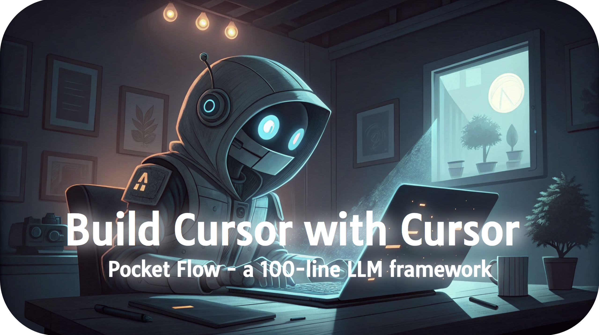

<h1 align="center">Build Cursor with Cursor</h1>

Cursor is cool! But what if we use it to build an open-source, customizable AI coding agent? We’ll develop a “Cursor Agent” that writes, reviews, and refactors code—right within Cursor itself. It’s meta, it’s moddable, and it’s powered by the power of Cursor. Let’s build Cursor…with Cursor.

<p align="center">
  
</p>

- To install: 
  ```bash
  pip install -r requirements.txt
  ```

- To run the Agent
  ```bash
  python main.py --query "List all Python files" --working-dir ./project
  ```

## Development Tutorial

- I built using **Agentic Coding**, the fastest development paradigm, where humans simply [design](docs/design.md) and agents [code](flow.py).

- The secret weapon is [Pocket Flow](https://github.com/The-Pocket/PocketFlow), a 100-line LLM framework that lets Agents (e.g., Cursor AI) build for you
  
- Step-by-step YouTube development tutorial coming soon! [Subscribe for notifications](https://www.youtube.com/@ZacharyLLM?sub_confirmation=1).

## Examples

We provide an example `project` of SaaS product homepage for the code agent to edit.

To run the page:

```
npm install
npm run dev
```

Here are some example queries you can try:
- "For Trusted by industry leaders, add two more boxes."
- "Please move the image near the title "Streamline Your Business Operations" below the title rather than next to it."
