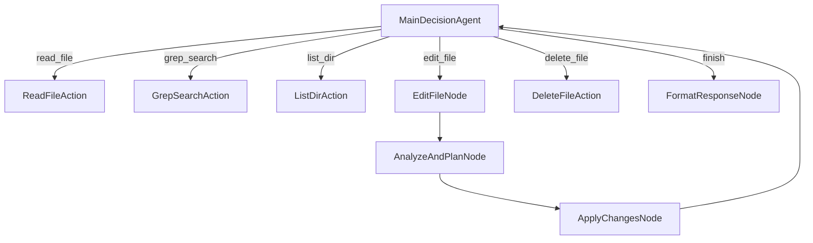

# Building Cursor with Cursor: A Step-by-Step Guide to Creating Your Own AI Coding Agent


Have you ever wished you could customize your AI coding assistant to work exactly the way you want? What if you could build your own version of Cursor—an AI-powered code editor—using Cursor itself? That's exactly what we're doing in this tutorial: creating a customizable, open-source AI coding agent that operates right within Cursor.

In this step-by-step guide, we'll dive deep into the code to show you how to build a powerful AI assistant that can:

- Navigate and understand codebases
- Implement code changes based on natural language instructions
- Make intelligent decisions about which files to inspect or modify
- Learn from its own history of operations

Let's dive in!

## Table of Contents

1. [Understanding the Architecture](#understanding-the-architecture-1)
2. [Setting Up Your Environment](#setting-up-your-environment-2)
3. [The Core: Building with Pocket Flow](#the-core-building-with-pocket-flow-3)
4. [Implementing Decision Making](#implementing-decision-making-4)
5. [File Operations: Reading and Writing Code](#file-operations-reading-and-writing-code-5)
6. [Code Analysis and Planning](#code-analysis-and-planning-6)
7. [Applying Code Changes](#applying-code-changes-7)
8. [Running Your Agent](#running-your-agent-8)
9. [Advanced: Customizing Your Agent](#advanced-customizing-your-agent-9)
10. [Conclusion and Next Steps](#conclusion-and-next-steps-10)

<a id="understanding-the-architecture-1"></a>
## 1. Understanding the Architecture

Before we write a single line of code, let's understand the architecture of our Cursor Agent. The system is built on a flow-based architecture using [Pocket Flow](https://github.com/The-Pocket/PocketFlow), a minimalist 100-line LLM framework that enables agentic development.

Here's a high-level overview of our architecture:



This architecture separates concerns into distinct nodes:
- Decision making (what operation to perform next)
- File operations (reading, writing, and searching)
- Code analysis (understanding and planning changes)
- Code modification (safely applying changes)

<a id="setting-up-your-environment-2"></a>
## 2. Setting Up Your Environment

Let's get our environment ready:

```bash
# Clone the repository
git clone https://github.com/The-Pocket/Tutorial-Cursor
cd Tutorial-Cursor

# Install dependencies
pip install -r requirements.txt
```

<a id="the-core-building-with-pocket-flow-3"></a>
## 3. The Core: Building with Pocket Flow

Our agent is built on the Pocket Flow framework, which provides three core abstractions:

1. **Nodes**: Individual units of computation that perform specific tasks
2. **Flows**: Directed graphs of nodes that define the program's execution path
3. **Shared Store**: A dictionary that all nodes can access to share data

Let's look at the core imports and setup:

```python
# flow.py
from pocketflow import Node, Flow, BatchNode
import os
import yaml
import logging
from datetime import datetime
from typing import List, Dict, Any, Tuple

# Import utility functions
from utils.call_llm import call_llm
from utils.read_file import read_file
from utils.delete_file import delete_file
from utils.replace_file import replace_file
from utils.search_ops import grep_search
from utils.dir_ops import list_dir
```

This imports the core classes from Pocket Flow and our custom utility functions that handle file operations and LLM calls.

<a id="implementing-decision-making-4"></a>
## 4. Implementing Decision Making

At the heart of our agent is the `MainDecisionAgent`, which determines what action to take based on the user's request and the current state of the system.

Here's how it's implemented:

```python
class MainDecisionAgent(Node):
    def prep(self, shared: Dict[str, Any]) -> Tuple[str, List[Dict[str, Any]]]:
        # Get user query and history
        user_query = shared.get("user_query", "")
        history = shared.get("history", [])
        
        return user_query, history
    
    def exec(self, inputs: Tuple[str, List[Dict[str, Any]]]) -> Dict[str, Any]:
        user_query, history = inputs
        
        # Format history for context
        history_str = format_history_summary(history)
        
        # Create prompt for the LLM
        prompt = f"""You are a coding assistant that helps modify and navigate code. Given the following request, 
decide which tool to use from the available options.

User request: {user_query}

Here are the actions you performed:
{history_str}

Available tools:
1. read_file: Read content from a file
   - Parameters: target_file (path)

2. edit_file: Make changes to a file
   - Parameters: target_file (path), instructions, code_edit

[... more tool descriptions ...]

Respond with a YAML object containing:
```yaml
tool: one of: read_file, edit_file, delete_file, grep_search, list_dir, finish
reason: |
  detailed explanation of why you chose this tool and what you intend to do
params:
  # parameters specific to the chosen tool
```"""
        
        # Call LLM to decide action
        response = call_llm(prompt)
        
        # Parse YAML response
        yaml_content = extract_yaml_from_response(response)
        decision = yaml.safe_load(yaml_content)
        
        # Validate the required fields
        assert "tool" in decision, "Tool name is missing"
        assert "reason" in decision, "Reason is missing"
        
        return decision
    
    def post(self, shared: Dict[str, Any], prep_res: Any, exec_res: Dict[str, Any]) -> str:
        # Add the decision to history
        shared.setdefault("history", []).append({
            "tool": exec_res["tool"],
            "reason": exec_res["reason"],
            "params": exec_res.get("params", {}),
            "timestamp": datetime.now().isoformat()
        })
        
        # Return the name of the tool to determine which node to execute next
        return exec_res["tool"]
```

This node:
1. Gathers the user's query and the history of previous actions
2. Formats a prompt for the LLM with all available tools
3. Calls the LLM to decide what action to take
4. Parses the response and validates it
5. Adds the decision to the history
6. Returns the name of the selected tool, which determines the next node to execute

<a id="file-operations-reading-and-writing-code-5"></a>
## 5. File Operations: Reading and Writing Code

Let's look at how our agent reads files, which is a fundamental operation:

```python
class ReadFileAction(Node):
    def prep(self, shared: Dict[str, Any]) -> str:
        # Get parameters from the last history entry
        history = shared.get("history", [])
        last_action = history[-1]
        file_path = last_action["params"].get("target_file")
        
        # Ensure path is relative to working directory
        working_dir = shared.get("working_dir", "")
        full_path = os.path.join(working_dir, file_path) if working_dir else file_path
        
        return full_path
    
    def exec(self, file_path: str) -> Tuple[str, bool]:
        # Call read_file utility which returns a tuple of (content, success)
        return read_file(file_path)
    
    def post(self, shared: Dict[str, Any], prep_res: str, exec_res: Tuple[str, bool]) -> str:
        # Unpack the tuple returned by read_file()
        content, success = exec_res
        
        # Update the result in the last history entry
        history = shared.get("history", [])
        if history:
            history[-1]["result"] = {
                "success": success,
                "content": content
            }
        
        return "decision"  # Go back to the decision node
```

The `read_file` utility function itself is implemented like this:

```python
def read_file(target_file: str) -> Tuple[str, bool]:
    """
    Read content from a file with support for line ranges.
    Prepends 1-based line numbers to each line in the output.
    
    Returns:
        Tuple of (file content with line numbers, success status)
    """
    try:
        if not os.path.exists(target_file):
            return f"Error: File {target_file} does not exist", False
        
        with open(target_file, 'r', encoding='utf-8') as f:
            lines = f.readlines()
            # Add line numbers to each line
            numbered_lines = [f"{i+1}: {line}" for i, line in enumerate(lines)]
            return ''.join(numbered_lines), True
            
    except Exception as e:
        return f"Error reading file: {str(e)}", False
```

This provides a clean, line-numbered view of the file content that makes it easier for the LLM to reference specific lines in its analysis.

<a id="code-analysis-and-planning-6"></a>
## 6. Code Analysis and Planning

When the agent needs to modify code, it first analyzes the code and plans the changes using `AnalyzeAndPlanNode`:

```python
class AnalyzeAndPlanNode(Node):
    def prep(self, shared: Dict[str, Any]) -> Dict[str, Any]:
        # Get history
        history = shared.get("history", [])
        last_action = history[-1]
        
        # Get file content and edit instructions
        file_content = last_action.get("file_content")
        instructions = last_action["params"].get("instructions")
        code_edit = last_action["params"].get("code_edit")
        
        return {
            "file_content": file_content,
            "instructions": instructions,
            "code_edit": code_edit
        }
    
    def exec(self, params: Dict[str, Any]) -> List[Dict[str, Any]]:
        file_content = params["file_content"]
        instructions = params["instructions"]
        code_edit = params["code_edit"]
        
        # Generate a prompt for the LLM to analyze the edit
        prompt = f"""
As a code editing assistant, I need to convert the following code edit instruction 
and code edit pattern into specific edit operations (start_line, end_line, replacement).

FILE CONTENT:
{file_content}

EDIT INSTRUCTIONS: 
{instructions}

CODE EDIT PATTERN (markers like "// ... existing code ..." indicate unchanged code):
{code_edit}

Analyze the file content and the edit pattern to determine exactly where changes should be made. 
Return a YAML object with your reasoning and an array of edit operations:

```yaml
reasoning: |
  Explain your thinking process about how you're interpreting the edit pattern.

operations:
  - start_line: 10
    end_line: 15
    replacement: |
      # New code here
```"""
        
        # Call LLM to analyze the edit
        response = call_llm(prompt)
        
        # Parse the response and extract edit operations
        yaml_content = extract_yaml_from_response(response)
        result = yaml.safe_load(yaml_content)
        
        # Store reasoning in shared memory
        shared["edit_reasoning"] = result.get("reasoning", "")
        
        # Return the operations
        return result.get("operations", [])
```

This node:
1. Extracts the file content, instructions, and code edit pattern from the history
2. Creates a prompt for the LLM to analyze the edit
3. Calls the LLM to determine the exact line numbers and replacement text
4. Parses the response to extract the edit operations
5. Stores the reasoning in shared memory
6. Returns the operations as a list of dictionaries

<a id="applying-code-changes-7"></a>
## 7. Applying Code Changes

Once the agent has planned the changes, it applies them using `ApplyChangesNode`:

```python
class ApplyChangesNode(BatchNode):
    def prep(self, shared: Dict[str, Any]) -> List[Dict[str, Any]]:
        # Get edit operations
        edit_operations = shared.get("edit_operations", [])
        
        # Sort edit operations in descending order by start_line
        # This ensures that line numbers remain valid as we edit from bottom to top
        sorted_ops = sorted(edit_operations, key=lambda op: op["start_line"], reverse=True)
        
        # Get target file from history
        history = shared.get("history", [])
        last_action = history[-1]
        target_file = last_action["params"].get("target_file")
        
        # Ensure path is relative to working directory
        working_dir = shared.get("working_dir", "")
        full_path = os.path.join(working_dir, target_file) if working_dir else target_file
        
        # Attach file path to each operation
        for op in sorted_ops:
            op["target_file"] = full_path
        
        return sorted_ops
    
    def exec(self, op: Dict[str, Any]) -> Tuple[bool, str]:
        # Call replace_file utility to replace content
        return replace_file(
            target_file=op["target_file"],
            start_line=op["start_line"],
            end_line=op["end_line"],
            content=op["replacement"]
        )
    
    def post(self, shared: Dict[str, Any], prep_res: List[Dict[str, Any]], exec_res_list: List[Tuple[bool, str]]) -> str:
        # Check if all operations were successful
        all_successful = all(success for success, _ in exec_res_list)
        
        # Update edit result in history
        history = shared.get("history", [])
        if history:
            history[-1]["result"] = {
                "success": all_successful,
                "operations": len(exec_res_list),
                "details": [{"success": s, "message": m} for s, m in exec_res_list],
                "reasoning": shared.get("edit_reasoning", "")
            }
        
        return "decision"  # Go back to the decision node
```

This node is a `BatchNode`, which allows it to process multiple operations in a single run. It:
1. Gets the edit operations from shared memory
2. Sorts them in descending order by start line to ensure edits remain valid
3. Attaches the target file path to each operation
4. Executes each operation using the `replace_file` utility
5. Updates the history with the results
6. Returns to the decision node

The `replace_file` utility works by combining `remove_file` and `insert_file`:

```python
def replace_file(target_file: str, start_line: int, end_line: int, content: str) -> Tuple[str, bool]:
    try:
        # First, remove the specified lines
        remove_result, remove_success = remove_file(target_file, start_line, end_line)
        
        if not remove_success:
            return f"Error during remove step: {remove_result}", False
        
        # Then, insert the new content at the start line
        insert_result, insert_success = insert_file(target_file, content, start_line)
        
        if not insert_success:
            return f"Error during insert step: {insert_result}", False
        
        return f"Successfully replaced lines {start_line} to {end_line}", True
        
    except Exception as e:
        return f"Error replacing content: {str(e)}", False
```

<a id="running-your-agent-8"></a>
## 8. Running Your Agent

Now that we've implemented all the key components, let's put it all together in our `main.py`:

```python
import os
import argparse
import logging
from flow import coding_agent_flow

def main():
    # Parse command-line arguments
    parser = argparse.ArgumentParser(description='Coding Agent - AI-powered coding assistant')
    parser.add_argument('--query', '-q', type=str, help='User query to process', required=False)
    parser.add_argument('--working-dir', '-d', type=str, default=os.path.join(os.getcwd(), "project"), 
                        help='Working directory for file operations')
    args = parser.parse_args()
    
    # If no query provided via command line, ask for it
    user_query = args.query
    if not user_query:
        user_query = input("What would you like me to help you with? ")
    
    # Initialize shared memory
    shared = {
        "user_query": user_query,
        "working_dir": args.working_dir,
        "history": [],
        "response": None
    }
    
    # Run the flow
    coding_agent_flow.run(shared)

if __name__ == "__main__":
    main()
```

And finally, let's create the flow in `flow.py`:

```python
# Define the nodes
main_decision = MainDecisionAgent()
read_file_action = ReadFileAction()
grep_search_action = GrepSearchAction()
list_dir_action = ListDirAction()
delete_file_action = DeleteFileAction()
edit_file_node = EditFileNode()
analyze_plan_node = AnalyzeAndPlanNode()
apply_changes_node = ApplyChangesNode()
format_response_node = FormatResponseNode()

# Connect the nodes
main_decision - "read_file" >> read_file_action
main_decision - "grep_search" >> grep_search_action
main_decision - "list_dir" >> list_dir_action
main_decision - "delete_file" >> delete_file_action
main_decision - "edit_file" >> edit_file_node
main_decision - "finish" >> format_response_node

# Connect action nodes back to main decision
read_file_action - "decision" >> main_decision
grep_search_action - "decision" >> main_decision
list_dir_action - "decision" >> main_decision
delete_file_action - "decision" >> main_decision

# Connect edit flow
edit_file_node - "analyze" >> analyze_plan_node
analyze_plan_node - "apply" >> apply_changes_node
apply_changes_node - "decision" >> main_decision

# Create the flow
coding_agent_flow = Flow(start=main_decision)
```

Now you can run your agent with:

```bash
python main.py --query "List all Python files" --working-dir ./project
```

<a id="advanced-customizing-your-agent-9"></a>
## 9. Advanced: Customizing Your Agent

One of the most powerful aspects of this architecture is how easy it is to customize. Let's explore a few ways you can extend this agent:

### 1. Adding New Tools

To add a new tool, simply:
1. Create a new action node class
2. Add it to the `MainDecisionAgent`'s prompt
3. Connect it to the flow

For example, to add a "run_tests" tool:

```python
class RunTestsAction(Node):
    def prep(self, shared):
        # Get test directory from parameters
        history = shared.get("history", [])
        last_action = history[-1]
        test_dir = last_action["params"].get("test_dir")
        return test_dir
    
    def exec(self, test_dir):
        # Run tests and capture output
        import subprocess
        result = subprocess.run(
            ["pytest", test_dir], 
            capture_output=True, 
            text=True
        )
        return result.stdout, result.returncode == 0
    
    def post(self, shared, prep_res, exec_res):
        # Update history with test results
        output, success = exec_res
        history = shared.get("history", [])
        if history:
            history[-1]["result"] = {
                "success": success,
                "output": output
            }
        return "decision"

# Then add to your flow:
run_tests_action = RunTestsAction()
main_decision - "run_tests" >> run_tests_action
run_tests_action - "decision" >> main_decision
```

### 2. Improving Code Analysis

You can enhance the code analysis capabilities by modifying the prompts in `AnalyzeAndPlanNode`:

```python
# Add language-specific hints
language_hints = {
    ".py": "This is Python code. Look for function and class definitions.",
    ".js": "This is JavaScript code. Look for function declarations and exports.",
    # Add more languages as needed
}

# Update the prompt with language-specific hints
file_ext = os.path.splitext(target_file)[1]
language_hint = language_hints.get(file_ext, "")
prompt += f"\n\nLANGUAGE HINT: {language_hint}"
```

### 3. Adding Memory and Context

To give your agent more context, you could add a vector database to store and retrieve relevant information:

```python
from langchain.vectorstores import Chroma
from langchain.embeddings import OpenAIEmbeddings

class VectorDBNode(Node):
    def prep(self, shared):
        # Get text to store
        history = shared.get("history", [])
        context = ""
        for action in history:
            if action["tool"] == "read_file" and action.get("result", {}).get("success", False):
                content = action["result"]["content"]
                context += f"File: {action['params']['target_file']}\n{content}\n\n"
        return context
    
    def exec(self, context):
        # Store in vector DB
        embeddings = OpenAIEmbeddings()
        vectordb = Chroma.from_texts(
            texts=[context], 
            embedding=embeddings,
            persist_directory="./db"
        )
        return vectordb
    
    def post(self, shared, prep_res, exec_res):
        shared["vectordb"] = exec_res
        return "decision"
```

<a id="conclusion-and-next-steps-10"></a>
## 10. Conclusion and Next Steps

Congratulations! You've built a customizable AI coding agent that can help you navigate and modify code based on natural language instructions. This agent demonstrates the power of agentic development, where AI systems help build better AI systems.

The possibilities for extending this agent are endless:
- Add support for more programming languages
- Implement code refactoring capabilities
- Create specialized tools for specific frameworks
- Add security checks before making changes
- Implement static analysis to catch potential bugs

As LLM capabilities continue to improve, agents like this will become even more powerful tools in a developer's arsenal.

Want to learn more? Subscribe to our [YouTube channel](https://www.youtube.com/@ZacharyLLM?sub_confirmation=1) for a step-by-step video tutorial on building and extending this agent.

Happy coding!
