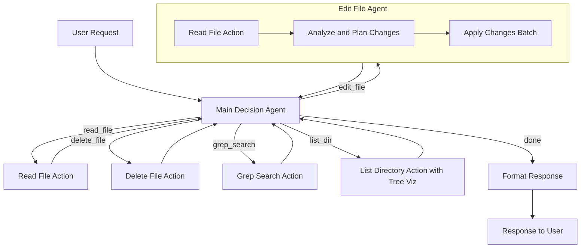

# Design Doc: Coding Agent

> Please DON'T remove notes for AI

## Requirements

> Notes for AI: Keep it simple and clear.
> If the requirements are abstract, write concrete user stories

Implement a Coding Agent, based on the following cursor instruction:

```
API Parameters and Tool Usage
===========================

1. File Operations:
   - read_file:
     * target_file: Path to the file (relative or absolute)
     * explanation: One sentence explaining the purpose
     * (Note: Will automatically read the entire file)

   - edit_file:
     * target_file: Path to the file to modify
     * instructions: Clear, single-sentence description of the edit
     * code_edit: The code changes with context, following these rules:
       - Use "// ... existing code ..." to represent unchanged code between edits
       - Include sufficient context around the changes to resolve ambiguity
       - Minimize repeating unchanged code
       - Never omit code without using the "// ... existing code ..." marker
       - No need to specify line numbers - the context helps locate the changes
       Example:
       ```
       // ... existing code ...
       function newEdit() {
         // new code here
       }
       // ... existing code ...
       ```

   - delete_file:
     * target_file: Path to the file to delete
     * explanation: Purpose of the deletion

2. Search Operations:
   - grep_search:
     * query: Exact text or regex pattern to find
     * case_sensitive: Optional boolean
     * include_pattern: Optional file type filter (e.g. "*.ts")
     * exclude_pattern: Optional files to exclude
     * explanation: Purpose of the search
     Note: Results capped at 50 matches

3. Directory Operations:
   - list_dir:
     * relative_workspace_path: Path to list contents of
     * explanation: Purpose of listing

Important Notes:
- All file paths can be relative
- Explanations should be clear and concise
- Tool calls must include all required parameters
- Optional parameters should only be included when necessary
- Use exact values provided by the user when available
- File search results are limited to 10 results
```

We want to additionally add a code edit agent that, given the context, updates the file.

Note: For educational purposes, the instruction is a simplification of cursor. Specifically:
1. For read_file, cursor AI reads by a small chunk specified by line number, and 250 lines at maximum.
   Reading by chunk is a good practice to avoid large files.
   However, here we read the entire file directly.
2. For search, Cursor AI also supports codebase_search (embedding) and file_search (fuzzy file name).
   Here, we only consider grep_search.
3. Cursor AI also supports run_terminal_cmd, web_search, diff_history.
   Here, we exclude these actions.

## Flow Design

> Notes for AI:
> 1. Consider the design patterns of agent, map-reduce, rag, and workflow. Apply them if they fit.
> 2. Present a concise, high-level description of the workflow.

### Applicable Design Pattern

1. Main Decision Agent
    - **Context**: User input, system context, and previous action results
    - **Action Space**:
      - `read_file`: {target_file, explanation}
      - `edit_file`: {target_file, instructions, code_edit}
      - `delete_file`: {target_file, explanation}
      - `grep_search`: {query, case_sensitive, include_pattern, exclude_pattern, explanation}
      - `list_dir`: {relative_workspace_path, explanation}
      - `finish`: Return final response to user
    - **Flow**:
      1. Parse user request and examine current state
      2. Match request to available tools
      3. Select tool and prepare parameters
      4. Run tool or call Edit File Agent
      5. Analyze results and decide next step (another tool or finish)
      6. When complete, format final response

2. Edit File Agent
    - **Context**: File path, content, and edit instructions
    - **Internal Flow**:
      1. **Read File Action**:
          - Reads target file to understand full context
          - Parameters: {target_file, explanation="Reading for edit analysis"}
          - Provides complete code structure for analysis
      
      2. **Analyze and Plan Changes Node**:
          - Reviews edit instructions from Main Agent
          - Outputs a list of specific edits in format:
            ```
            [
              {
                start_line: int,  // First line to replace (1-indexed)
                end_line: int,    // Last line to replace (1-indexed)
                replacement: str  // New code 
              },
              ...
            ]
            ```
      
      3. **Apply Changes Batch Node**:
          - Processes each edit in the plan
          - Sorts edits in **descending order by start_line** (from bottom to top of file)
          - This ensures that line numbers remain valid for all edits since changes to later lines won't affect the position of earlier lines
          - Applies edits in correct order to handle overlapping changes

### Flow High-level Design



## Utility Functions

> Notes for AI:
> 1. Understand the utility function definition thoroughly by reviewing the doc.
> 2. Include only the necessary utility functions, based on nodes in the flow.

**IMPORTANT**: All file and directory paths in utility functions should be interpreted relative to the `working_dir` provided in the shared memory. Utilities should construct absolute paths by joining `working_dir` with the relative paths they receive as parameters.

1. **Call LLM** (`utils/call_llm.py`)
   - Makes API calls to language model services
   - Input: prompt/messages
   - Output: LLM response text

2. **File Operations**
   - **Read File** (`utils/read_file.py`)
     - Reads content from specified files
     - Input: target_file
     - Output: file content, success status
   
   - **Insert File** (`utils/insert_file.py`)
     - Writes or inserts content to a target file
     - Input: target_file, content, line_number
     - Output: result message, success status
   
   - **Remove File** (`utils/remove_file.py`)
     - Removes content from a file based on line numbers
     - Input: target_file, start_line (optional), end_line (optional)
     - Output: result message, success status
   
   - **Delete File** (`utils/delete_file.py`)
     - Deletes a file from the file system
     - Input: target_file
     - Output: result message, success status
   
   - **Replace File** (`utils/replace_file.py`)
     - Replaces content in a file based on line numbers
     - Input: target_file, start_line, end_line, new_content
     - Output: result message, success status

3. **Search Operations** (`utils/search_ops.py`)
   - **Grep Search**
     - Searches through files for specific patterns using ripgrep-like functionality
     - Input: query, case_sensitive (optional), include_pattern (optional), exclude_pattern (optional), working_dir (optional)
     - Output: list of matches (file path, line number, content), success status
   
4. **Directory Operations** (`utils/dir_ops.py`)
   - **List Directory**
     - Lists contents of a directory with a tree visualization
     - Input: relative_workspace_path
     - Output: success status, tree visualization string

With these utility functions, we can implement the nodes defined in our flow design to create a robust coding agent that can read, modify, search, and navigate through codebase files.

## Node Design

### Shared Memory

An improved and simpler shared memory structure:

```python
shared = {
    # User's original query
    "user_query": str,
    
    # Current working directory - all file operations are relative to this path
    "working_dir": str,    # IMPORTANT: All file paths in operations are interpreted relative to this directory
    
    # Action history - stores all actions and their results
    "history": [
        {
            "tool": str,              # Tool name (e.g., "read_file")
            "reason": str,            # Brief explanation of why this tool was called
            "params": dict,           # Parameters used for the tool
            "result": any,            # Result returned by the tool
            "timestamp": str          # When the action was performed
        }
    ],
    
    # For edit operations (only used during edits)
    "edit_operations": [
        {
            "start_line": int,
            "end_line": int,
            "replacement": str
        }
    ],
    
    # Final response to return to user
    "response": str
}
```

### Node Steps

1. Main Decision Agent Node
- **Purpose**: Interprets user requests and decides which tool to use
- **Type**: Regular Node
- **Steps**:
  - **prep**: 
    - Read `shared["user_query"]` and `shared["history"]`
    - Return user query and relevant history
  - **exec**:
    - Call LLM to decide which tool to use and prepare parameters
    - Return tool name, reason for using it, and parameters
  - **post**:
    - Add new action to `shared["history"]` with tool, reason, and parameters
    - Return action string for the selected tool

2. Read File Action Node
- **Purpose**: Reads specified file content
- **Type**: Regular Node
- **Steps**:
  - **prep**:
    - Get file path from last entry in `shared["history"]["params"]`
    - Ensure path is interpreted relative to `shared["working_dir"]`
    - Return file path
  - **exec**:
    - Call read_file utility with the path
    - Return file content
  - **post**:
    - Update last history entry with result
    - Return "decide_next"

3. Grep Search Action Node
- **Purpose**: Searches for patterns in files
- **Type**: Regular Node
- **Steps**:
  - **prep**:
    - Get search parameters from last entry in `shared["history"]["params"]`
    - Ensure any path patterns are interpreted relative to `shared["working_dir"]`
    - Return search parameters
  - **exec**:
    - Call grep_search utility
    - Return search results
  - **post**:
    - Update last history entry with results
    - Return "decide_next"

4. List Directory Action Node
- **Purpose**: Lists directory contents with tree visualization
- **Type**: Regular Node
- **Steps**:
  - **prep**:
    - Get directory path from last entry in `shared["history"]["params"]`
    - Ensure path is interpreted relative to `shared["working_dir"]`
    - Return path
  - **exec**:
    - Call list_dir utility which now returns (success, tree_str)
    - Return success status and tree visualization string
  - **post**:
    - Update last history entry with the result:
      ```python
      history_entry = shared["history"][-1]
      success, tree_str = exec_res
      history_entry["result"] = {
          "success": success,
          "tree_visualization": tree_str
      }
      ```
    - Return "decide_next"

5. Delete File Action Node
- **Purpose**: Deletes a file
- **Type**: Regular Node
- **Steps**:
  - **prep**:
    - Get file path from last entry in `shared["history"]["params"]`
    - Ensure path is interpreted relative to `shared["working_dir"]`
    - Return file path
  - **exec**:
    - Call delete_file utility
    - Return success status
  - **post**:
    - Update last history entry with result
    - Return "decide_next"

6. Read Target File Node (Edit Agent)
- **Purpose**: Reads file for editing (first step in edit process)
- **Type**: Regular Node
- **Steps**:
  - **prep**:
    - Get file path from last entry in `shared["history"]["params"]` (the edit_file action)
    - Ensure path is interpreted relative to `shared["working_dir"]`
    - Return file path
  - **exec**:
    - Call read_file utility to read entire file
    - Return file content
  - **post**:
    - Store file content in the history entry
    - Return "analyze_plan"

7. Analyze and Plan Changes Node (Edit Agent)
- **Purpose**: Plans specific edit operations
- **Type**: Regular Node
- **Steps**:
  - **prep**:
    - Get file content from history
    - Get edit instructions and code_edit from history params
    - Return file content, instructions, and code_edit
  - **exec**:
    - Call LLM to analyze and create edit plan
    - Return structured list of edits
  - **post**:
    - Store edits in `shared["edit_operations"]`
    - Return "apply_changes"

8. Apply Changes Batch Node (Edit Agent)
- **Purpose**: Applies edits to file
- **Type**: BatchNode
- **Steps**:
  - **prep**:
    - Read `shared["edit_operations"]`
    - Sort in descending order by start_line
    - Return sorted edit operations
  - **exec**:
    - For each edit operation, call replace_file utility with:
      - target_file (from history)
      - start_line and end_line (from edit operation)
      - replacement (from edit operation)
    - Return success status for each operation
  - **post**:
    - Update edit result in history
    - Clear `shared["edit_operations"]` after processing
    - Return "decide_next"

9. Format Response Node
- **Purpose**: Creates response for user
- **Type**: Regular Node
- **Steps**:
  - **prep**:
    - Read `shared["history"]`
    - Return history
  - **exec**:
    - Call LLM to generate response
    - Return formatted response
  - **post**:
    - Store response in `shared["response"]`
    - Return "done"